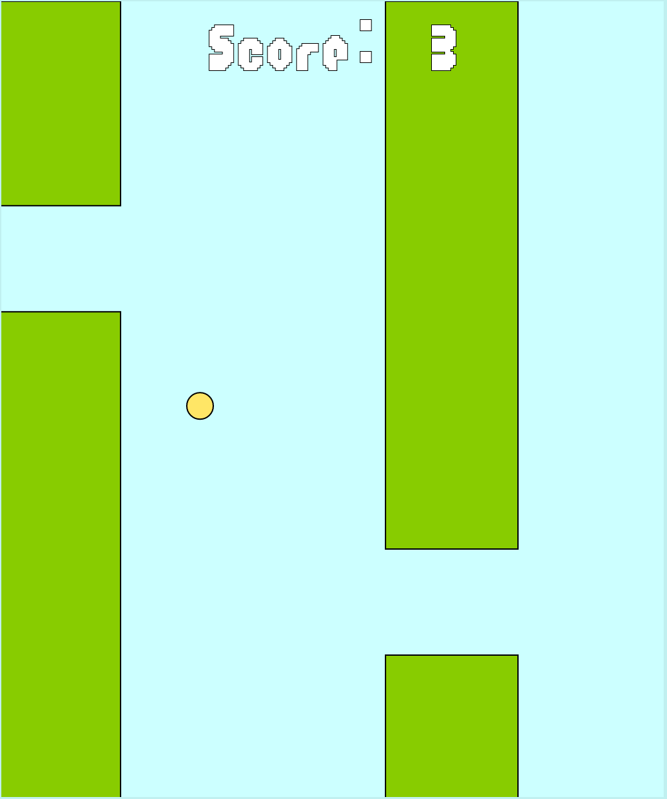

# Flappy JS - Modern Edition

A modernized Flappy Bird game built with vanilla JavaScript and Canvas API. Originally created in 2020 with Processing and p5.js, rebuilt in 2026.



## Features

- Modern tech stack: ES6+ JavaScript, Vite, Canvas API
- Responsive design for desktop and mobile
- Touch controls, keyboard support, high scores with localStorage
- Visual polish: particle effects, screen shake, parallax backgrounds

## Quick Start

```bash
npm install
npm run dev
```

Visit `http://localhost:5173` to play.

## Gameplay

- **Desktop**: Space bar or click to jump
- **Mobile**: Tap to jump
- Navigate through pipe gaps without hitting them or the ground

## Development

```bash
npm run dev      # Development server
npm run build    # Production build
npm run preview  # Preview build locally
```

## Project Structure

```
src/
├── main.js           # Entry point
├── Game.js           # Game controller
├── Bird.js           # Bird entity
├── Tubes.js          # Pipe obstacles
├── Score.js          # Score display
└── utils/
    ├── Background.js       # Parallax background
    ├── ParticleSystem.js   # Visual effects
    ├── ScreenShake.js      # Screen shake
    ├── audio.js            # Sound management
    └── storage.js          # High score persistence
```

## Live Demo

Play at [https://mapuya19.github.io/flappy-js/](https://mapuya19.github.io/flappy-js/)

## Original Version

The original 2020 version was built with Processing and p5.js. View it here: [github.com/mapuya19/flappy](https://github.com/mapuya19/flappy)

## License

MIT
