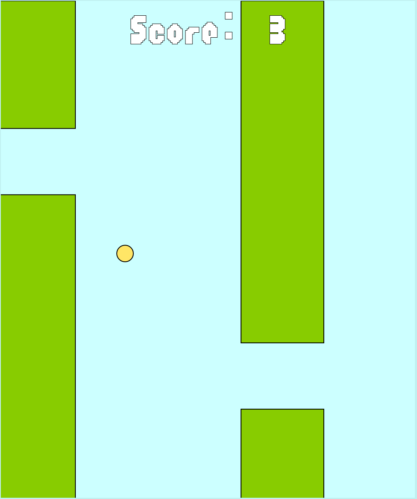
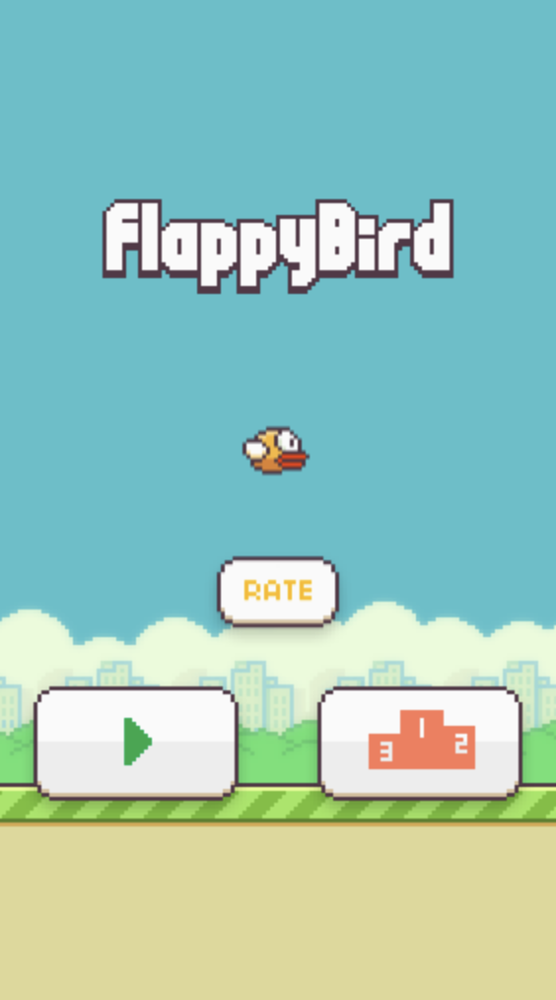

# Flappy JS - Modern Edition

A modernized Flappy Bird game built with vanilla JavaScript and Canvas API. Originally created in 2020 with Processing and p5.js, completely rebuilt in 2026.

<p align="center">
  
  
</p>
<p align="center"><small>Left: Original 2020 version • Right: Modern 2026 rebuild</small></p>

## Version Compatibility

This implementation replicates **Flappy Bird v1.2/1.3** (iOS) behavior.

| v1.0 / v1.1 Era | v1.2 / v1.3 Era |
|---|---|
| Single yellow bird sprite | ✅ Multiple bird colors (Yellow, Blue, Red) - randomly selected |
| Lower frame rate (choppy) | ✅ Higher frame rate (smoother gameplay) |
| Simple UI/menus | ✅ Redesigned UI with cleaner layouts |
| Basic green pipes | ✅ Polished green pipe sprites |
| Single theme | ✅ Day & Night theme toggle |
| Pause button present | ❌ Pause button removed |
| Ads mid-game | ✅ Ads only on start/end screens |
| Simple start/score screen | ✅ Revamped UI with bigger buttons |
| Title says "Flap Flap" | ✅ Fixed title says "Flappy Bird" |

**Archive**: [Flappy Bird v1.3 Archive](https://archive.org/details/flappy-bird-v-1.3)

### Physics & Gameplay:
- **Bird gravity**: 900 units/s²
- **Rotation formula**: `velocity * 0.2 + 60`, clamped to [-90°, 30°]
- **Pipe gap**: 135px
- **Score timing**: When bird's back end crosses pipe center (+16px offset)
- **Jump velocity**: -260 units/s

## Features

- Modern tech stack: ES6+ JavaScript, Vite, Canvas API
- Scene-based architecture with clean state management
- Responsive design for desktop and mobile
- Touch controls, keyboard support, high scores with localStorage
- Visual polish: parallax backgrounds, sprite animations
- Auto-deployment to GitHub Pages via GitHub Actions
- Efficient sprite atlas rendering system

## Quick Start

```bash
npm install
npm run dev
```

Visit `http://localhost:3000` to play.

## Gameplay

- **Desktop**: Space bar, Enter key, or click to jump
- **Mobile**: Tap anywhere to jump
- Navigate through pipe gaps without hitting them or the ground
- Earn medals based on your score (bronze, silver, gold, platinum)

## Development

```bash
npm run dev      # Development server on port 3000
npm run build    # Production build to dist/
npm run preview  # Preview production build locally
npm run lint     # Run ESLint
```

## Project Structure

```
src/
├── main.js           # Entry point
├── Game.js           # Main game controller
├── Bird.js           # Bird entity
├── Tubes.js          # Pipe obstacles manager
├── GameState.js      # Game state constants
├── scenes/           # Scene-based game states
│   ├── BaseScene.js      # Base scene class
│   ├── StartScene.js     # Title screen
│   ├── ReadyScene.js     # Ready state
│   ├── GameScene.js      # Active gameplay
│   ├── FallingScene.js   # Bird falling animation
│   └── GameOverScene.js  # Game over with score
├── ui/               # UI components
│   ├── Button.js         # Interactive buttons
│   └── ScorePanel.js     # Score display panel
└── utils/
    ├── AtlasLoader.js    # Sprite atlas loader
    ├── SpriteRenderer.js # Sprite rendering
    ├── audio.js          # Sound management
    ├── Background.js     # Parallax background
    ├── Ground.js         # Scrolling ground
    └── storage.js        # High score persistence

public/
└── assets/
    ├── sprites/          # Sprite atlas (atlas.png, atlas.json)
    └── *.m4a             # Sound files
```

## Architecture

### Scene System
The game uses a scene-based architecture where each game state (Start, Ready, Playing, Falling, Game Over) is handled by a dedicated scene class. All scenes extend `BaseScene` and implement:

- `onEnter()` - Scene initialization
- `onExit()` - Scene cleanup
- `update(deltaTime)` - Game logic updates
- `draw(ctx)` - Rendering
- `handleInput(x, y)` - Input handling
- `handleRelease(x, y)` - Input release handling

### Sprite Atlas
All game assets are loaded from a sprite atlas (`atlas.png` with `atlas.json` metadata) for efficient rendering. Sprites are referenced by name and rendered via `SpriteRenderer`.

### Game Loop
Delta time-based updates ensure consistent gameplay across different frame rates. The loop is capped at 30 FPS minimum for consistency.

## Deployment

The game is automatically deployed to GitHub Pages via GitHub Actions:

- **Live Demo**: [https://matthewapuya.com/flappy-js/](https://matthewapuya.com/flappy-js/)
- **Workflow**: Builds on push to master branch
- **Source**: GitHub Actions

To deploy locally:
```bash
npm run build
# Upload contents of dist/ to your hosting provider
```

## Original Version

The original 2020 version was built with Processing and p5.js. View it here: [github.com/mapuya19/flappy](https://github.com/mapuya19/flappy)

## License

MIT
